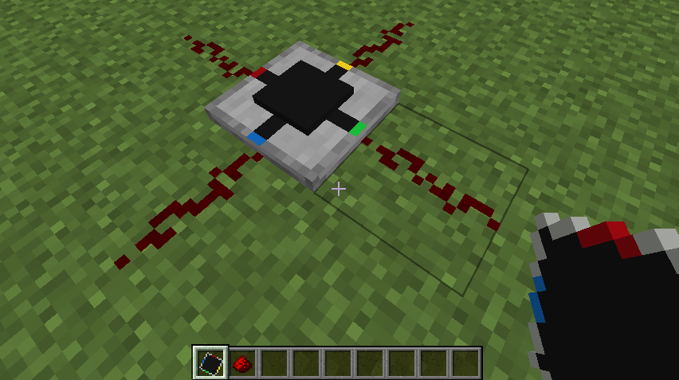

# Integrated circuit

A Minecraft mod that adds an integrated circuit redstone component.
Each integrated circuit block has a 15x15 grid where you can place two-dimensional
redstone components. Each side of the circuit can be used as an input or output for your circuit.

<iframe width="560" height="315" src="https://www.youtube-nocookie.com/embed/rxT5y_9KsVI" title="YouTube video player" frameborder="0" allow="accelerometer; autoplay; clipboard-write; encrypted-media; gyroscope; picture-in-picture" allowfullscreen></iframe>

## How to use

(For now this is a creative only mod, but I plan to add a crafting recipe and a way to duplicate circuits later)

In the redstone tab, you can find the Integrated circuit item.
When you place it down and click on it, it will open the circuit editor screen.
You can select a block on the left, and place it in the 15x15 grid as you normally would in minecraft.
To rotate a component, you use the scroll wheel.
Adjusting repeater delay or the comparator mode is done by clicking on a component.

The four ports are labeled using four colors to associate them with the sides of the integrated circuit block.
Each port can be an input or output, which can be changed by clicking on it in the editor.